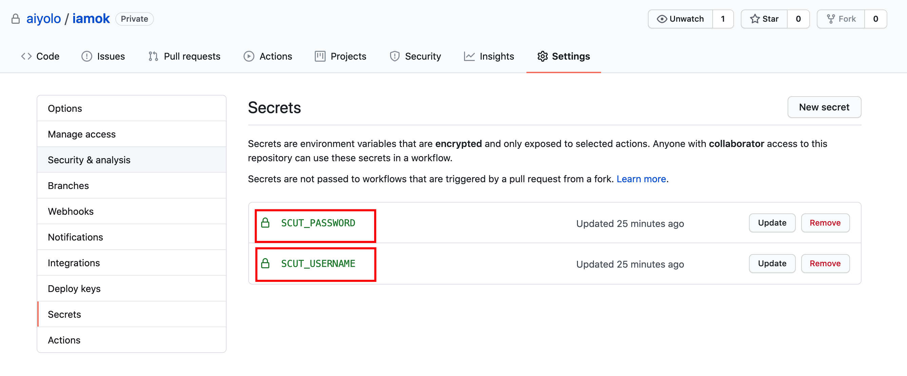
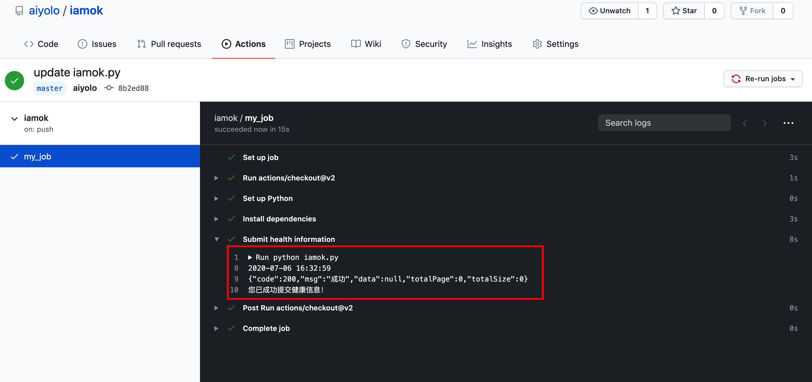

## 用途

自动填报iamok系统

(Note: 此项目仅用在健康状态维持不变时自动填报，如果你的健康状态发生了改变，请立即进入健康系统如实填报你的最新状态！)

## 原理

requests模拟登陆 + github workflows 定时执行任务

## 使用方法

fork 本项目，然后在你的 `settings` 页面创建下面两个`key`保存你的学号和密码即可。

每天9点，会自动提交你的健康信息。

如下图显示的，就说明提交成功。（你可能需要修改一些不重要的文件如readme文件并提交更改，才能立即看到以下执行结果）

