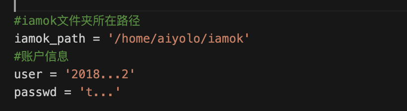

## 用途

自动填报iamok系统

## 原理

requests模拟登陆 + crontab定时执行任务（在ubuntu系统上测试可行）

## 使用方法

### 1、克隆本项目到本地

```bash
git clone https://gitee.com/aiyolo/iamok
```

建议放在用户目录下

### 2、安装依赖

```bash
pip install -r requirements.txt
```

### 3、修改账户信息

进入`iamok.py`，找到下面几行，修改iamok文件夹路径，以及账户信息



### 4、 创建crontab任务

```
crontab -e
```

在最后一行添加:

`* * * * * python ~/iamok/iamok.py >> ~/iamok/iamok.log 2>&1`

即每隔一分钟执行一次`python iamok.py`, 并且把输出重定向到`iamok.log`

(注意：对应好依赖环境中的python 版本，以及py文件位置)

### 5、验证是否成功

如果iamok.log文件输出如下，就说明上面的设置成功了！不放心的话，从浏览器进入填报页面，查看有没有显示**今天已经填报过了**

```bash
(base) ➜  ~ cat iamok.log
2020-06-07 00:42:01
{"code":200,"msg":"成功","data":null,"totalPage":0,"totalSize":0}
```

如果没问题的话，把crontab任务执行时间重新修改一下：

如下，设置成每天8点执行一次

`0 8 * * * python ~/iamok/iamok.py >> ~/iamok/iamok.log 2>&1`